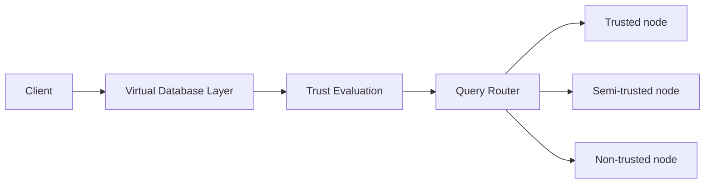
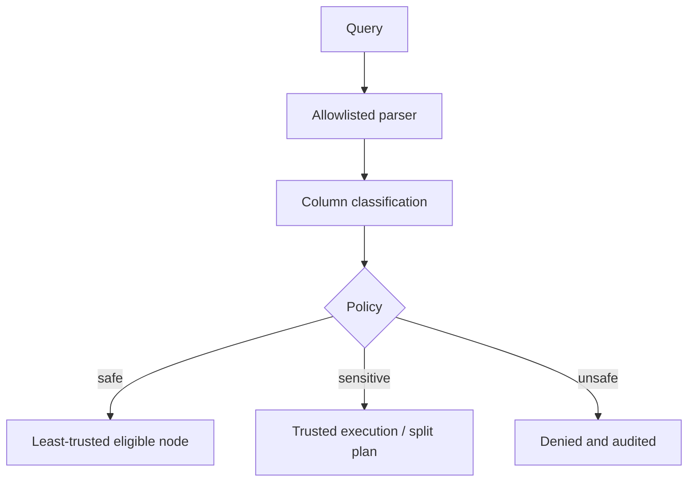

# Trust-Aware Virtual Database (TAVDB)

TAVDB is a runnable educational prototype of a virtual database layer: a client calls one API, while that layer validates a limited SQL dialect, classifies requested columns, routes work by node trust, and produces an immutable-style audit trail. It demonstrates access control and query isolation; it does **not** claim cryptographic confidentiality against a fully compromised execution node.





## Trust model and security

`employees.id` is PUBLIC, `name` and `department` INTERNAL, `salary` CONFIDENTIAL, and `medical_information` HIGHLY_CONFIDENTIAL. Non-trusted nodes may only SELECT approved tables and cannot receive confidential columns. Mixed queries requested against a non-trusted node are rewritten to trusted execution; the audit record describes the split plan. The production extension point is in `VirtualDatabaseLayer._run`, where real separately credentialed replicas would execute the projection fragments.

SQL is constrained to single, simple SELECT statements over allowlisted tables/columns. Semicolons, comments, destructive DDL, UNION, and mutations are blocked. This is deliberate: it is not a general SQL gateway.

Docker includes three physical PostgreSQL node containers plus metadata PostgreSQL. The `non-trusted-db` uses its own `nontrusted_user` credentials and is not exposed by an API or host port. Its initialization grants only `SELECT(id,name,department)` and explicitly omits salary, medical data, mutation, and metadata privileges. The virtual layer applies the same policy before delegation.

## Run

Local (uses SQLite metadata):

```bash
python -m venv .venv
.venv\\Scripts\\activate
pip install -r requirements.txt
uvicorn app.main:app --reload
python demo.py
pytest -q
```

Or start services with `docker compose up --build`, then open `/docs` or `/dashboard/`. Register, log in, pass `Authorization: Bearer <token>`, and call `POST /queries` with `{ "sql": "SELECT name FROM employees", "preferred_node": "non-trusted-node" }`.

## Data model and audit

SQLAlchemy models cover User, Database, Node, TableMetadata, ColumnMetadata, QueryRequest, QueryExecution, and AuditLog. Every decision includes requested data, selected node/trust level, reason, outcome, and duration at `GET /audit/logs`.

## Limitations / future work

This is a small demonstration, with in-process replica data and a restricted parser instead of a full AST/optimizer. It does not implement encryption at rest/in transit, key management, differential privacy, TEEs, row-level policy, distributed transactions, or cryptographic protection after a trusted node is compromised. Production work should use a mature SQL parser, parameter binding, real replica initialization/grants, TLS, secrets management, and optionally TEE/encrypted-compute integration.
